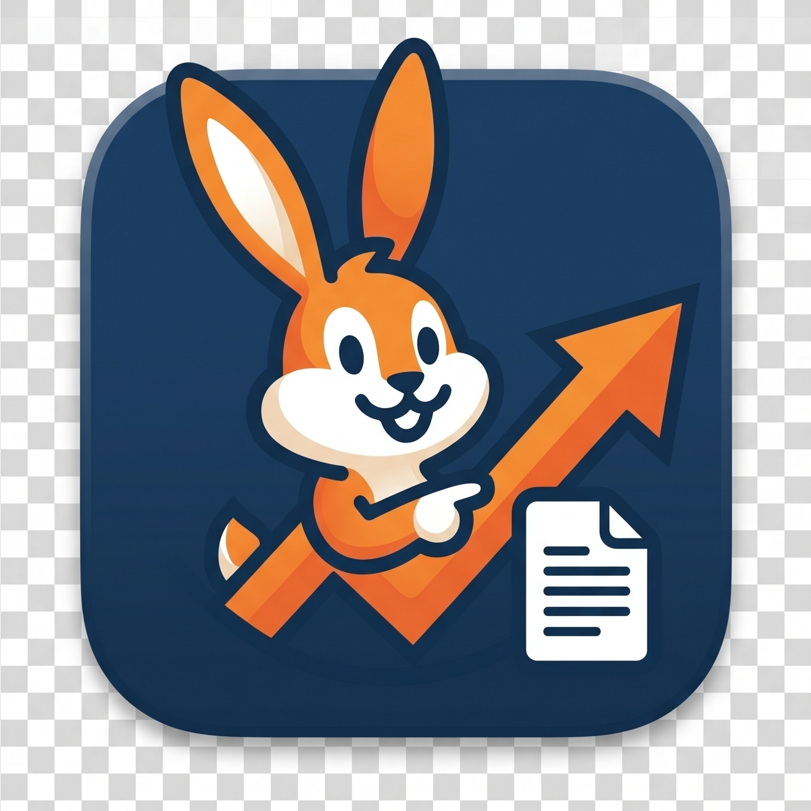

# updoc

`updoc` is a native macOS note-taking app for engineers and managers who live in the Google ecosystem. It gives you a fast, distraction-free local editing experience with deep Calendar, Docs, and Drive integration.



## Why updoc?

Most Google Docs workflows suffer from tab fatigue and latency. `updoc` bridges the gap by providing:
- **Zero-lag editing:** A CodeMirror 6 editor (WebKit-hosted) with live Markdown rendering and syntax hiding.
- **Deep Google integration:** Bidirectional sync with Google Docs, Drive, and Calendar.
- **Task-first workflow:** A dedicated sidebar that promotes checklist items to tracked tasks.
- **Native macOS shell:** SwiftUI + SwiftData wrapper around the editor, so the app feels native while the editor is best-in-class.

---

## Features

### Markdown Editor (CodeMirror 6)
Write in clean Markdown with real-time theme-aware rendering. The editor is a [CodeMirror 6](https://codemirror.net/) bundle served from the app via a `WKWebView`:
- Headings H1–H6, bold, italic, bold+italic
- Underline (`~text~`), strikethrough (`~~text~~`), highlight (`==text==`)
- Inline code and fenced code blocks with syntax highlighting
- Blockquotes, horizontal rules, links
- GFM task lists (`- [ ] task`) with interactive checkboxes; `√` (Option+V) inserts `- [ ] `
- Syntax hiding: markers disappear when the cursor moves off-line
- Theme-aware colors and fonts via CSS custom properties

### Google Sync
- **Bidirectional sync:** Edit locally or on the web; `updoc` handles the rest.
- **Smart conflict resolution:** Side-by-side UI for resolving version mismatches.
- **Drive asset library:** Images are automatically synced to a dedicated `updoc_assets` folder.

### Meeting-aware organization
- **Calendar integration:** Automatically links notes to Google Calendar events.
- **Smart folder trees:** Auto-organizes notes into `/updoc/Meetings` (by date) or `/updoc/General`.
- **Meeting attribution:** Tracks attendees and event metadata for context.

### Integrated task sidebar
- **Global action items:** All tasks across all notes, grouped as Overdue / Today / Upcoming.
- **Bidirectional checkbox sync:** Toggling a task in the sidebar updates the source note instantly.
- **Note navigation:** Click any task to jump to the relevant line in the editor.

### Image handling
- **Native Markup:** Double-click any image to open the macOS Markup toolkit.
- **Cloud parity:** Image metadata maintains sync between local files and Google Docs.

---

## Tech Stack

| Layer | Technology |
|---|---|
| Language | Swift 6.0 (strict concurrency) |
| UI | SwiftUI |
| Persistence | SwiftData |
| Editor | CodeMirror 6 (TypeScript, bundled via esbuild) |
| Editor host | WKWebView + custom `editor://` URL scheme handler |
| Auth | GTMAppAuth + AuthenticationServices |
| Sync | Google Drive / Docs / Calendar REST APIs |

---

## Getting Started

### Prerequisites
- macOS 14.0+
- Swift 5.9+ (comes with Xcode 15 or the standalone toolchain)
- Node.js 18+ and npm — required to **rebuild** the editor bundle if you change TypeScript source. The pre-built `editor.js` is committed to the repo, so Swift builds work without Node.
- A Google Cloud project with Docs, Drive, and Calendar APIs enabled.

### Building from source

```bash
git clone https://github.com/bnaylor/updoc.git
cd updoc
./scripts/bundle.sh       # produces updoc.app in the repo root
open updoc.app
```

To rebuild the editor bundle after TypeScript changes:

```bash
cd editor && npm ci && cd ..
./scripts/build_editor.sh
```

### Configuration

On first launch, open **Settings (Cmd+,)** and enter your Google Client ID and Secret to enable sync.

---

## Development status

Active development. The CodeMirror 6 editor migration is complete; the legacy TextKit 2 editor has been removed. Known gap: inline image rendering (``) shows as styled text until a follow-up decoration pass is implemented.

See [STATUS.md](STATUS.md) for feature details and [docs/ROADMAP.md](docs/ROADMAP.md) for what's next.

---

## License

Private — for personal use.
